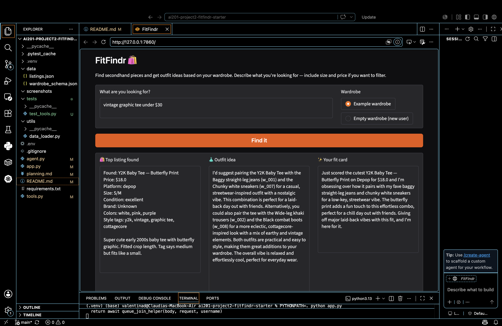
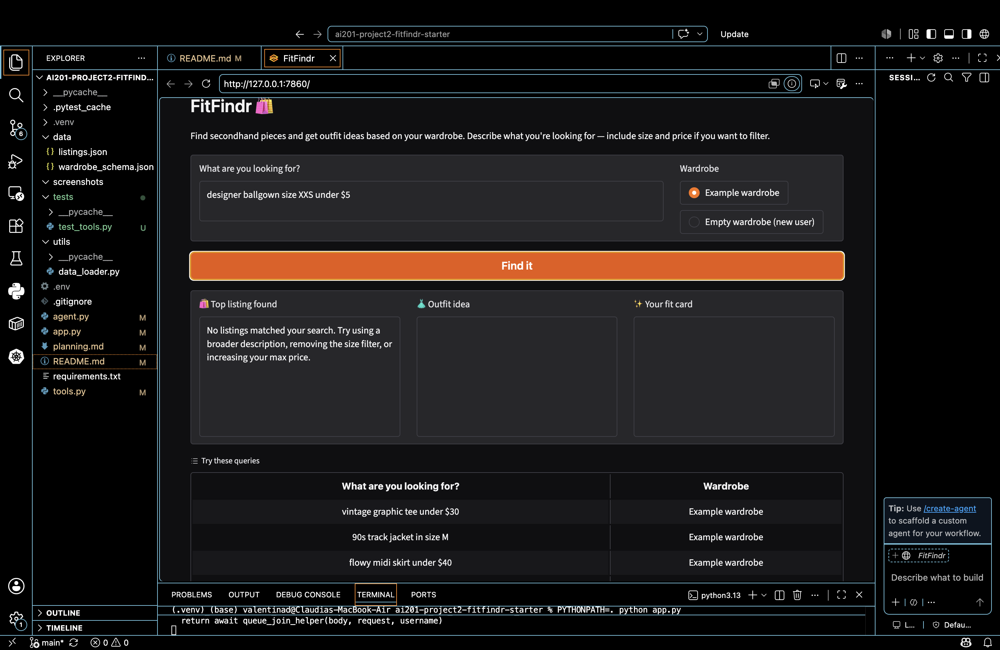

# FitFindr

FitFindr is a multi-tool AI agent that helps users discover secondhand fashion items, style them with their existing wardrobe, and generate a shareable outfit caption. The system combines search, outfit planning, and caption generation into a single workflow while handling errors gracefully when information is missing or no listings are found.

---

# Features

* Search secondhand clothing listings by description, size, and price.
* Generate outfit suggestions using the user's wardrobe.
* Create social-media-style outfit captions.
* Maintain state across multiple tool calls.
* Handle empty search results gracefully.
* Handle empty wardrobes without crashing.
* Handle missing outfit data safely.
* Gradio web interface.

---

# Tool Inventory

## Tool 1: search_listings

### Purpose

Searches the mock secondhand listings dataset for items matching a user's request.

### Inputs

```python
search_listings(
    description: str,
    size: str | None = None,
    max_price: float | None = None
)
```

### Parameters

| Parameter   | Type          | Description                          |
| ----------- | ------------- | ------------------------------------ |
| description | str           | Keywords describing the desired item |
| size        | str or None   | Optional clothing size filter        |
| max_price   | float or None | Optional maximum price filter        |

### Output

```python
list[dict]
```

Returns a list of matching listing dictionaries sorted by relevance.

Each listing contains:

```python
{
    "id": str,
    "title": str,
    "description": str,
    "category": str,
    "style_tags": list,
    "size": str,
    "condition": str,
    "price": float,
    "colors": list,
    "brand": str,
    "platform": str
}
```

### Failure Handling

If no listings match the request:

```python
[]
```

is returned instead of raising an exception.

---

## Tool 2: suggest_outfit

### Purpose

Uses the selected thrifted item and wardrobe information to generate outfit ideas.

### Inputs

```python
suggest_outfit(
    new_item: dict,
    wardrobe: dict
)
```

### Output

```python
str
```

Returns one or more outfit suggestions.

### Failure Handling

If the wardrobe is empty, the tool returns general styling advice rather than failing.

Example:

```text
Pair the item with relaxed jeans, clean sneakers, and simple accessories for a casual everyday look.
```

---

## Tool 3: create_fit_card

### Purpose

Creates a short social-media-ready outfit caption.

### Inputs

```python
create_fit_card(
    outfit: str,
    new_item: dict
)
```

### Output

```python
str
```

Returns a short caption suitable for Instagram, TikTok, or Threads.

### Failure Handling

If the outfit string is empty:

```text
I need an outfit suggestion before I can create a fit card.
```

is returned instead of raising an exception.

---

# Planning Loop

The agent follows a sequential planning loop that makes decisions based on previous results.

### Step 1

Parse the user's query and extract:

* Description
* Size
* Maximum price

Store these values in:

```python
session["parsed"]
```

### Step 2

Call:

```python
search_listings()
```

Store results in:

```python
session["search_results"]
```

### Step 3

Check search results.

If empty:

```python
session["error"] = ...
```

Return early and stop execution.

The outfit and fit card tools are not called.

### Step 4

Select the top result.

Store in:

```python
session["selected_item"]
```

### Step 5

Call:

```python
suggest_outfit()
```

Store result in:

```python
session["outfit_suggestion"]
```

### Step 6

Call:

```python
create_fit_card()
```

Store result in:

```python
session["fit_card"]
```

### Step 7

Return the completed session.

---

# State Management

The agent uses a session dictionary as the single source of truth.

```python
session = {
    "query": query,
    "parsed": {},
    "search_results": [],
    "selected_item": None,
    "wardrobe": wardrobe,
    "outfit_suggestion": None,
    "fit_card": None,
    "error": None,
}
```

### State Flow

```text
search_listings
        ↓
selected_item
        ↓
suggest_outfit
        ↓
outfit_suggestion
        ↓
create_fit_card
        ↓
fit_card
```

This allows information from earlier tools to be reused without asking the user to enter it again.

---

# Architecture

```text
User Query
     │
     ▼
Planning Loop
     │
     ▼
search_listings()
     │
     ├── No Results
     │       │
     │       ▼
     │   Error Message
     │
     ▼
selected_item
     │
     ▼
suggest_outfit()
     │
     ▼
outfit_suggestion
     │
     ▼
create_fit_card()
     │
     ▼
fit_card
     │
     ▼
Return Session
```

---

# Error Handling

## No Search Results

Query:

```text
designer ballgown size XXS under $5
```

Result:

```text
No listings matched your search.
Try using a broader description,
removing the size filter,
or increasing your max price.
```

The planning loop stops immediately.

---

## Empty Wardrobe

Input:

```python
get_empty_wardrobe()
```

Result:

The tool generates general styling advice instead of failing.

---

## Missing Outfit

Input:

```python
create_fit_card("", item)
```

Result:

```text
I need an outfit suggestion before I can create a fit card.
```

---

# Testing

Tool tests were written using pytest.

Run:

```bash
PYTHONPATH=. python -m pytest
```

Result:

```text
5 passed
```

The following scenarios were tested:

* Search returns results
* Search returns no results
* Price filtering works
* Empty wardrobe handling
* Missing outfit handling

---

# Running the Application

## Install Dependencies

```bash
pip install -r requirements.txt
pip install groq python-dotenv pytest
```

## Create Environment File

Create:

```env
.env
```

Add:

```env
GROQ_API_KEY=your_api_key_here
```

## Run the App

```bash
PYTHONPATH=. python app.py
```

Open the Gradio URL shown in the terminal.

Example:

```text
http://127.0.0.1:7860
```

---

# Example Queries

```text
vintage graphic tee under $30
```

```text
90s track jacket size M
```

```text
black combat boots size 8
```

```text
flowy midi skirt under $40
```

```text
designer ballgown size XXS under $5
```

---

# AI Usage

## Example 1 — Tool Implementation

I used Claude to help implement the three required tools. I provided the tool specifications from planning.md, including each tool's purpose, inputs, outputs, and failure modes.

Claude generated initial implementations for:

* `search_listings()`
* `suggest_outfit()`
* `create_fit_card()`

Before using the generated code, I reviewed it to ensure the function signatures matched the project requirements and verified that each tool handled its failure case correctly. I also tested each tool independently before integrating them into the planning loop.

---

## Example 2 — Planning Loop Implementation

I used Claude to help implement the planning loop in `agent.py`.

I provided:

* The Planning Loop section from planning.md
* The State Management section from planning.md
* The Architecture diagram

Claude generated an initial version of the agent workflow. I reviewed and modified the code to match the starter repository structure and verified that:

* `search_listings()` runs first
* The agent stops early when no results are found
* `suggest_outfit()` only runs when a valid item exists
* `create_fit_card()` only runs when an outfit suggestion exists
* State is passed between tools using the session dictionary

---

## Example 3 — Testing and Debugging

I used Claude to help create pytest test cases and troubleshoot implementation issues.

Claude helped generate tests for:

* Empty search results
* Empty wardrobe handling
* Missing outfit input
* Price filtering

After generating the tests, I executed them locally using pytest and verified that all tests passed. I also manually tested the Gradio application to confirm both successful and failure paths behaved as expected.

---

## How AI Was Used Responsibly

Claude was used as a development assistant to generate implementation ideas, code drafts, test cases, and debugging suggestions. All generated code was reviewed, modified when necessary, and tested before being included in the final project. I remained responsible for the final design decisions, implementation, testing, and validation of the system.


# Reflection

Designing the planning loop before writing code made implementation significantly easier. Defining the tool interfaces first helped keep responsibilities separate and made debugging more manageable.

The most important lesson from this project was that state management is what turns a collection of functions into an agent. Each tool depends on information generated by previous tools, and maintaining that information inside a shared session object creates a smooth user experience.

Error handling was also critical. By explicitly designing failure behavior before implementation, the system remained useful even when no listings were found or when wardrobe information was unavailable.

# Demo Video

## Successful Search Workflow



## Error Handling Example


