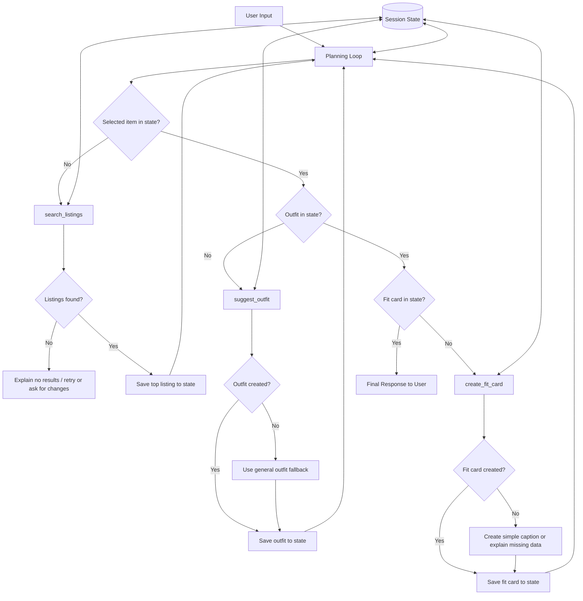

# FitFindr — planning.md

## Tools

### Tool 1: search_listings

**What it does:**
Searches the mock listings dataset for secondhand clothing items that match the user's description, size, and max price. It filters listings using fields like title, description, category, style tags, size, condition, price, colors, brand, and platform.

**Input parameters:**

* `description` (str): The clothing item or style the user is looking for, such as "vintage graphic tee".
* `size` (str): The user's preferred size, such as "M", "L", or "8".
* `max_price` (float): The highest price the user is willing to pay.

**What it returns:**
A list of matching listing dictionaries. Each result may include `id`, `title`, `description`, `category`, `style_tags`, `size`, `condition`, `price`, `colors`, `brand`, and `platform`.

**What happens if it fails or returns nothing:**
The agent tells the user no listings matched their request. It can either stop and ask the user to loosen the search or retry with fewer constraints, such as removing the size filter or increasing the price range.

---

### Tool 2: suggest_outfit

**What it does:**
Suggests one or more outfit combinations using the new item found by `search_listings` and the user's current wardrobe. It explains how the user could style the item in a practical way.

**Input parameters:**

* `new_item` (dict): The selected listing returned from `search_listings`.
* `wardrobe` (dict): The user's wardrobe data, including items they already own.

**What it returns:**
An outfit suggestion as a dictionary or string. It should include the new item, wardrobe pieces to pair with it, styling notes, and the overall vibe of the outfit.

**What happens if it fails or returns nothing:**
If the wardrobe is empty or too minimal, the agent still gives a basic outfit idea using common clothing pieces. It should clearly explain that the suggestion is general because there were not enough wardrobe items.

---

### Tool 3: create_fit_card

**What it does:**
Creates a short, shareable outfit caption based on the selected item and outfit suggestion. The caption should sound natural, stylish, and social-media friendly.

**Input parameters:**

* `outfit` (dict or str): The outfit suggestion created by `suggest_outfit`.
* `new_item` (dict): The selected listing being styled.

**What it returns:**
A short fit card/caption as a string. It should mention the item, price or platform if available, and the overall outfit vibe.

**What happens if it fails or returns nothing:**
If the outfit data is missing or incomplete, the agent creates a simpler caption using only the new item details. If the new item is also missing, it tells the user it needs an item before creating a fit card.

---

## Planning Loop

**How does your agent decide which tool to call next?**

The agent uses a loop that checks the current session state after each step. First, it looks at the user request and extracts the item description, size, max price, and wardrobe details. If no selected item exists in state, it calls `search_listings`. If listings are found, the agent saves the top listing as the selected item. If no listings are found, the agent stops or retries with looser filters.

Next, if a selected item exists but no outfit suggestion exists, the agent calls `suggest_outfit` using the selected item and wardrobe. If an outfit is created, it is saved in state. Finally, if an outfit exists but no fit card exists, the agent calls `create_fit_card`. The loop ends when the agent has a selected item, an outfit suggestion, and a fit card, or when an error path requires the agent to stop and ask the user for more information.

The agent does not call all tools automatically every time. It only calls the next tool when the previous tool returned useful information.

---

## State Management

**How does information from one tool get passed to the next?**

The agent stores session information in a state dictionary while handling one user request. The state keeps track of the original user query, extracted search filters, search results, selected item, wardrobe, outfit suggestion, fit card, and any errors.

Example state:

```python
state = {
    "user_query": "",
    "description": "",
    "size": "",
    "max_price": None,
    "wardrobe": {},
    "search_results": [],
    "selected_item": None,
    "outfit": None,
    "fit_card": None,
    "errors": []
}
```

When `search_listings` returns results, the top result is stored as `state["selected_item"]`. Then `suggest_outfit` uses `state["selected_item"]` and `state["wardrobe"]`. After that, `create_fit_card` uses `state["outfit"]` and `state["selected_item"]`. This allows the user to give information once instead of re-entering it for each tool.

---

## Error Handling

| Tool            | Failure mode                          | Agent response                                                                                                                                                                |
| --------------- | ------------------------------------- | ----------------------------------------------------------------------------------------------------------------------------------------------------------------------------- |
| search_listings | No results match the query            | Tell the user no matching listings were found. Suggest loosening the size, price, or description. If retry logic is added, retry with fewer filters and explain what changed. |
| suggest_outfit  | Wardrobe is empty                     | Give a general outfit suggestion using common wardrobe basics and explain that the suggestion is less personalized because the wardrobe is empty.                             |
| create_fit_card | Outfit input is missing or incomplete | Create a simpler caption using the selected item only. If no item exists, tell the user a fit card cannot be created yet.                                                     |

---

## Architecture



---

## AI Tool Plan

### Milestone 3 — Individual Tool Implementations

I used Claude to help implement each tool one at a time.

For `search_listings`, I provided the Tool 1 specification from this planning document, the available listing fields from `listings.json`, and the requirement to use `load_listings()` from `utils/data_loader.py`. I expected Claude to generate a function that filters listings by description, size, and maximum price and returns relevant results. I verified the implementation by testing searches with matching results, no results, and price constraints.

For `suggest_outfit`, I provided the Tool 2 specification and wardrobe schema. I expected Claude to generate a function that accepts a selected item and wardrobe data and produces practical outfit suggestions. I verified the implementation using both `get_example_wardrobe()` and `get_empty_wardrobe()` to ensure the tool handled normal and empty wardrobe cases.

For `create_fit_card`, I provided the Tool 3 specification and examples of the desired caption style. I expected Claude to generate a function that creates short, social-media-friendly captions. I verified the implementation by testing multiple outfit suggestions and confirming that the generated captions varied appropriately.

### Milestone 4 — Planning Loop and State Management

I used Claude to help implement the agent planning loop using the Planning Loop, State Management, and Architecture sections of this document.

I expected Claude to generate a workflow that:

* Parses the user's request
* Calls `search_listings()` first
* Stops early if no listings are found
* Passes the selected item into `suggest_outfit()`
* Passes the outfit suggestion into `create_fit_card()`
* Stores information in a shared session dictionary

I verified the implementation by running a complete interaction that successfully used all three tools and a second interaction that triggered the no-results error path.


## A Complete Interaction (Step by Step)

**Example user query:**
"I'm looking for a vintage graphic tee under $30. I mostly wear baggy jeans and chunky sneakers. What's out there and how would I style it?"

**Step 1:**
The agent reads the user query and extracts:

* description: `"vintage graphic tee"`
* size: unknown or default from the user if provided
* max_price: `30.0`
* wardrobe details: baggy jeans and chunky sneakers

The agent calls:

```python
search_listings(description="vintage graphic tee", size=None, max_price=30.0)
```

**Step 2:**
`search_listings` returns matching listings. The agent selects the best result, such as:

```python
{
    "id": "item_001",
    "title": "Faded Band Tee",
    "description": "Vintage-style graphic tee with a faded band print.",
    "category": "tops",
    "style_tags": ["vintage", "graphic", "grunge"],
    "size": "M",
    "condition": "Good",
    "price": 22.0,
    "colors": ["black", "gray"],
    "brand": "Unknown",
    "platform": "Depop"
}
```

The agent saves this item in state as `selected_item`.

**Step 3:**
The agent sees that a selected item exists but no outfit has been created yet. It calls:

```python
suggest_outfit(new_item=selected_item, wardrobe=user_wardrobe)
```

The tool returns an outfit suggestion like:

```text
Pair the faded band tee with your baggy jeans and chunky sneakers for a relaxed 90s streetwear look. Add a simple belt or small silver accessories to make the outfit feel more intentional.
```

The agent saves this as `state["outfit"]`.

**Step 4:**
The agent sees that an outfit exists but no fit card exists yet. It calls:

```python
create_fit_card(outfit=state["outfit"], new_item=state["selected_item"])
```

The tool returns:

```text
thrifted this faded band tee for $22 and paired it with baggy denim + chunky sneakers — casual 90s energy without trying too hard
```

The agent saves this as `state["fit_card"]`.

**Final output to user:**

FitFindr found a good match: **Faded Band Tee** from Depop for **$22**, in good condition.

Style it with your baggy jeans and chunky sneakers for a relaxed 90s streetwear look. Add a simple belt or silver accessories if you want the outfit to feel more finished.

Fit card:
“thrifted this faded band tee for $22 and paired it with baggy denim + chunky sneakers — casual 90s energy without trying too hard”
